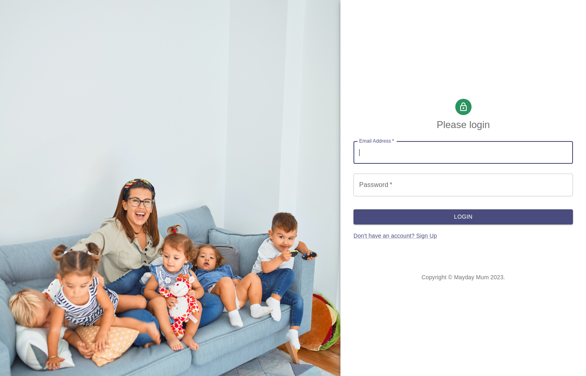

# Mayday MuM

  

To see the deployed site: https://maydaymum.staceyfanner.com/

 
This web-based application provides a centralized database that: 

- utilizes a MongoDB via Mongoose
- is built with React and Node.js via Express

The application performs user centric CRUD (Create, Read, Update) operations following REST-ful conventions for managing resources.

## About the Web App

Welcome to Mayday Mum – your trusted Northern Beaches destination for overnight nannying services. 

We understand that every parent needs a helping hand, especially during those long nights. Our fixed nightly fee covers a full 12 hours of dedicated support, so you can rest easy knowing your little ones are in caring hands. 

Join our Mayday Mum family today, and let us make your nights more peaceful and your mornings brighter.

## User stories
- I want to sign up to create an account based on my role (Nanny or Parent)
- I want to login to my account (specific view by role)
- I want to be able to read my profile
- I want to edit my profile
- I want to see a list of all nannies to see their profile information and availability 
- I want to book my chosen nanny

## Features
- Log in 
- Log out
- Sign up
- View a list the available nannies
- Pagination to mange the number of nannies listed
- View/add/update a profile
- Enable different views based on user's logged in status
- Book a nanny

## Data Relationship

<!--  

  -->
1:1
- user to parent
- user to nanny
 
1:M
- parent to booking
 
1:M
- nanny to availability   

## Screengrabs
| Logon View                                                                     | Sign Up View                                                                                    | Account View - Parent                                                                       | Find a nanny view                                                    |
| ------------------------------------------------------------------------------ | ------------------------------------------------------------------------------------------------ | ------------------------------------------------------------------------------------- | ---------------------------------------------------------------------- |
|  |  |  |  |

## Technologies Used

